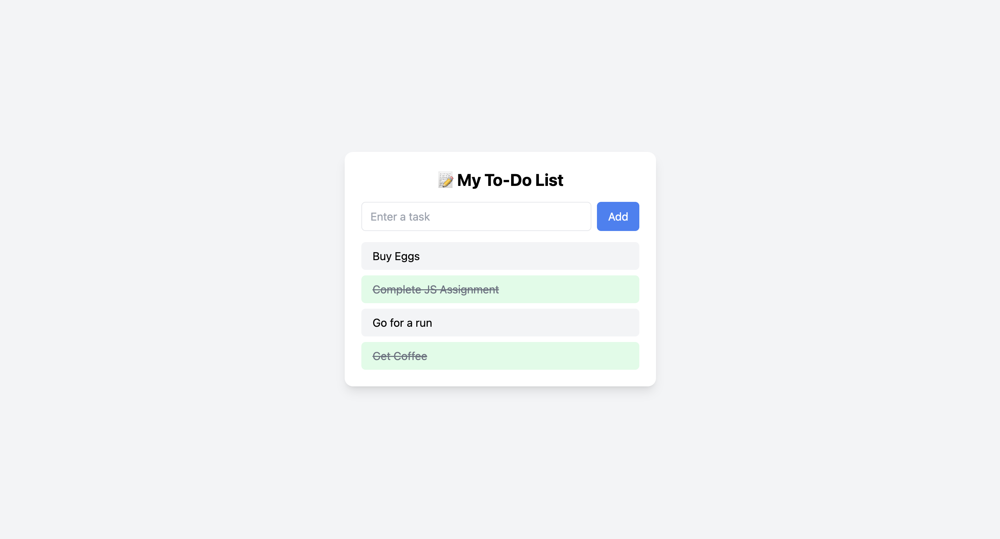

# 📝 To-Do List App

A simple and clean To-Do List web application built with **Vanilla JavaScript** and **Tailwind CSS**.

---

## 📌 Features

- ✅ Add tasks
- ✅ Mark tasks as completed
- ✅ Double-click to delete tasks
- ✅ Stores tasks in **localStorage**
- ✅ Responsive and minimal UI with Tailwind CSS

---

## 🛠️ Tech Stack

- **HTML** – Page structure
- **Tailwind CSS** – Styling with utility classes
- **JavaScript** – App logic and interaction
- **localStorage** – Saves tasks even after refreshing
- **Vercel** – Deployment platform (optional)

---

<pre>
  
## 📁 Project Structure

```
TO DO LIST/
├── assets/
│   └── screenshot.png
├── dist/
│   └── output.css
├── node_modules/
├── src/
│   └── input.css
├── .gitignore
├── index.html
├── script.js
├── tailwind.config.js
├── package-lock.json
└── package.json
```
</pre>

---

## 🚀 How to Run Locally

1. Clone this repository or download the folder
2. Install Tailwind and dependencies: ```bash npm install
3. Build Tailwind CSS: npx tailwindcss -i ./src/input.css -o ./dist/output.css --watch
4. Open index.html in your browser

---

 📸 Screenshot
 
 

 ---
 
## 🧠 What You’ll Learn

- DOM manipulation using JS  
- Working with event listeners (`click`, `dblclick`)  
- Using localStorage to save tasks  
- Tailwind CSS for styling clean UIs

 ---
 
 🔗 Live Demo
Hosted on Vercel:
👉 [View Live](https://to-do-list-eight-murex-17.vercel.app/)

